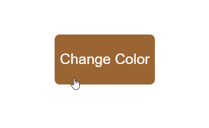

## Colorful Clickable Button

 

## 📖 About the project

This project was developed just to practice using java script [array](https://developer.mozilla.org/en-US/docs/Web/JavaScript/Reference/Global_Objects/Array), [indexOf](https://developer.mozilla.org/en-US/docs/Web/JavaScript/Reference/Global_Objects/Array/indexOf) method, and calculation strategy using module operator to obtain the <strong>next array index</strong> and always <strong>return to the beginning</strong> of the array <strong>regardless of its size</strong>.

## 🤖 Technologies

Technologies that I used to develop this project.

- [HTML5](https://www.w3schools.com/html/)
- [CSS3](https://www.w3schools.com/css/)
- [JavaScript](https://developer.mozilla.org/en-US/docs/Web/JavaScript)
