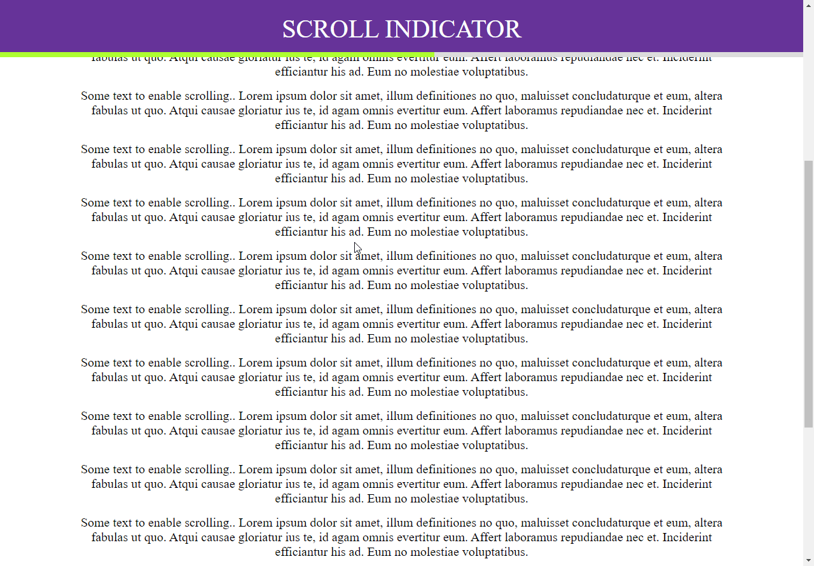

## Scroll Indicator

 

## 📖 About the project

This project was developed just to practice using [scrollHeight](https://developer.mozilla.org/en-US/docs/Web/API/Element/scrollHeight), [scrollTop](https://developer.mozilla.org/en-US/docs/Web/API/Element/scrollTop) and [clientHeight](https://developer.mozilla.org/en-US/docs/Web/API/Element/clientHeight), DOM elements properties.

## 🤖 Technologies

Technologies that I used to develop this project.

- [HTML5](https://www.w3schools.com/html/)
- [CSS3](https://www.w3schools.com/css/)
- [JavaScript](https://developer.mozilla.org/en-US/docs/Web/JavaScript)
