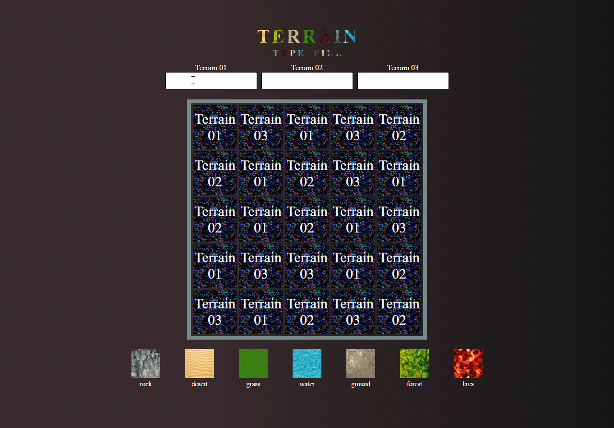

## Terrain Type Fill

 

## 📖 About the project

This project it's just a 5 x 5 board with 7 types of terrains that users can choose, and it has three terrain input fields.

each item on the board belongs to a specific area, and when the user types one of the 7 available types, all of the items of that area will change its background.

## 🤖 Technologies

Technologies that I used to develop this project.

- [HTML5](https://www.w3schools.com/html/)
- [CSS3](https://www.w3schools.com/css/)
  - [Flexbox](https://www.w3schools.com/css/css3_flexbox.asp)
  - [Grid Layout](https://www.w3schools.com/css/css_grid.asp)
- [JavaScript](https://developer.mozilla.org/en-US/docs/Web/JavaScript)

  - [querySelector](https://developer.mozilla.org/en-US/docs/Web/API/Document/querySelector)
  - [querySelectorAll](https://developer.mozilla.org/en-US/docs/Web/API/Document/querySelectorAll)
  - [getComputedStyle](https://developer.mozilla.org/en-US/docs/Web/API/Window/getComputedStyle)
  - [createElement](https://developer.mozilla.org/en-US/docs/Web/API/Document/createElement)
  - [forEach](https://developer.mozilla.org/en-US/docs/Web/JavaScript/Reference/Global_Objects/Array/forEach)
  - [split](https://developer.mozilla.org/en-US/docs/Web/JavaScript/Reference/Global_Objects/String/split)
  - [join](https://developer.mozilla.org/en-US/docs/Web/JavaScript/Reference/Global_Objects/Array/join)
  - [replace](https://developer.mozilla.org/en-US/docs/Web/JavaScript/Reference/Global_Objects/String/replace)
  - [find](https://developer.mozilla.org/en-US/docs/Web/JavaScript/Reference/Global_Objects/Array/find)
  - [addEventListener](https://developer.mozilla.org/en-US/docs/Web/API/EventTarget/addEventListener)
  - [appendChild](https://developer.mozilla.org/en-US/docs/Web/API/Node/appendChild)
  - [setTimeout](https://developer.mozilla.org/en-US/docs/Web/API/WindowOrWorkerGlobalScope/setTimeout)
  - [clearTimeout](https://developer.mozilla.org/en-US/docs/Web/API/WindowOrWorkerGlobalScope/clearTimeout)
  - [toLowerCase](https://developer.mozilla.org/en-US/docs/Web/JavaScript/Reference/Global_Objects/String/toLowerCase)
  - [getAttribute](https://developer.mozilla.org/en-US/docs/Web/API/Element/getAttribute)
  - [spread operator](https://developer.mozilla.org/en-US/docs/Web/JavaScript/Reference/Operators/Spread_syntax)
  - [logical OR operator](https://developer.mozilla.org/en-US/docs/Web/JavaScript/Reference/Operators/Logical_OR)
  - [logical AND operator](https://developer.mozilla.org/en-US/docs/Web/JavaScript/Reference/Operators/Logical_AND)
  - [strict inequality operator](https://developer.mozilla.org/en-US/docs/Web/JavaScript/Reference/Operators/Strict_inequality)
  - [optional chaining operator](https://developer.mozilla.org/en-US/docs/Web/JavaScript/Reference/Operators/Optional_chaining)

## ✨ Main Features

- function delays the processing of the key up event until the user has stopped typing for a predetermined amount of time.
- animation on background-image change.
- terrain options dynamically included HTML.
- function to abstract DOM element creation.
- custom attributes to identity terrains.
