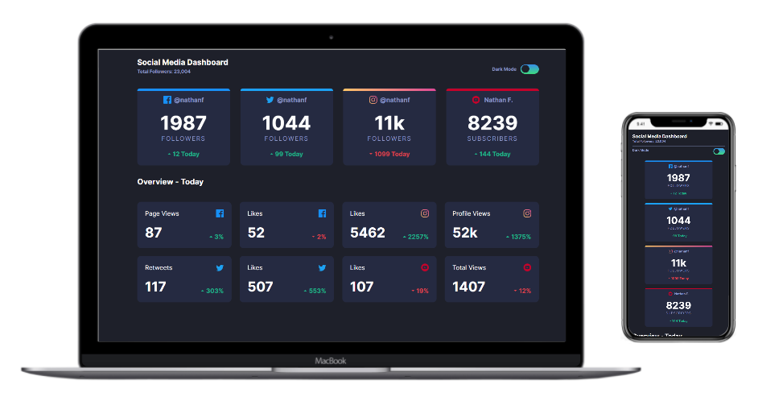

## Social Media Theme Switcher

 

## 📖 About the project

This project was developed just to practice the [Front End Mentor](https://www.frontendmentor.io/challenges/faq-accordion-card-XlyjD0Oam) layout.

## 🤖 Technologies

Technologies that I used to develop this project.

- [HTML5](https://www.w3schools.com/html/)
- [CSS3](https://www.w3schools.com/css/)
- [JavaScript](https://developer.mozilla.org/en-US/docs/Web/JavaScript)
